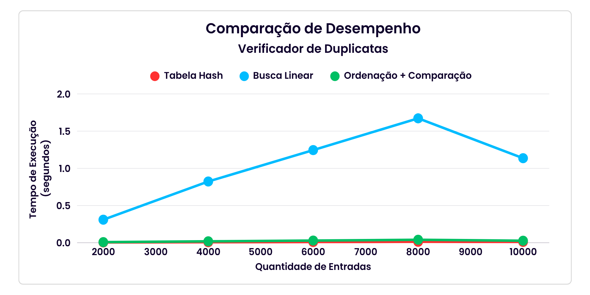

# 📁 Sumário

1. [Introdução](#1---introdução)
2. [Discentes e Docente](#2---discentes-e-docente)
   - [Discentes](#21---discentes)
   - [Docente](#22---docente) 
3. [Estrutura do Projeto](#3---estrutura-do-projeto)
4. [Funcionamento](#4---funcionamento)  
   - [Inserção Manual](#41---inserção-manual)  
   - [Importação via CSV](#42---importação-via-csv)  
5. [Requisitos](#5---requisitos)
6. [Compilação](#6---compilação)
7. [Execução](#7---execução)
8. [Comparação de Métodos](#8---comparação-de-métodos)
9. [Desempenho](#9---desempenho)
10. [Gráfico](#10---gráfico-de-desempenho)
11. [Desafios Encontrados](#11---desafios-encontrados)
12. [Observações](#12---observações)
13. [Licença](#13---licença)

---

# 1 - Introdução

Este projeto, desenvolvido em linguagem C, tem como objetivo verificar duplicatas em uma lista de strings inseridas manualmente ou importadas de um arquivo `.csv`. A aplicação utiliza três abordagens distintas para comparação e mostra os tempos de execução de cada uma.

---

# 2 - Discentes e Docente

### 2.1 - Discentes:

- **Nome e GitHuns:**
  - [Sophia Hellen Pires da Silveira](https://github.com/Sophiahellen02)
  - [Antonio Andson de Oliveira Rocha](https://github.com/Andyn-1307)
  - [Levi Filgueira Chagas](https://github.com/Levifc)
 
### 2.2 - Docente
- Kennedy Reurison Lopes

---

# 3 - Estrutura do Projeto

O projeto pode ser compilado em versão única (monolítica) ou modularizada, com os arquivos organizados nas pastas `src/` e `include/`. A versão modular separa responsabilidades entre leitura de entrada, verificação de duplicatas e medição de tempo, tornando o código mais organizado e reutilizável.

---

# 4 - Funcionamento

Ao executar, o programa exibe um menu com as opções:

```
============================
 VERIFICADOR DE DUPLICATAS
============================
1. Inserir manualmente
2. Importar CSV
0. Sair
============================
```

### 4.1 - Inserção Manual

- O usuário informa a quantidade de strings.
- Insere uma a uma no terminal.
- Pode digitar `sair` a qualquer momento para cancelar, retornando ao menu sem os resultados obtidos dos valores já inseridos.

### 4.2 - Importação via CSV

- O usuário fornece o nome de um arquivo `.csv` contendo uma string por linha.
- Em caso de erro na leitura, é oferecida a opção de tentar novamente ou sair.

---

# 5 - Requisitos

- GCC ou compilador C compatível
- Terminal com suporte a entrada interativa
- Arquivos `.csv` com strings (opcional)

---

# 6 - Compilação

## 🔧 Compilação (versão única)

```bash
cd VersãoCompleta
gcc VerificadorDuplicata.c -o verificador
```

## 📂 Compilação (versão modularizada)

```bash
cd VersãoModulada
gcc src/*.c -Iinclude -o verificador
```

---

# 7 - Execução

Após a compilação, execute:

```bash
./verificador                 # Para entrada manual
./verificador arquivo.csv     # Para importar um CSV direto
```

---

# 8 - Comparação de Métodos

| Método                     | Descrição                                            | Complexidade |
| -------------------------- | ---------------------------------------------------- | ------------ |
| **Tabela Hash**            | Armazena strings em uma tabela para detecção rápida. | O(n)         |
| **Busca Linear**           | Compara cada string com todas as outras.             | O(n²)        |
| **Ordenação + Comparação** | Ordena as strings e compara pares adjacentes.        | O(n log n)   |

---

# 9 - Desempenho

Resultados obtidos com base em entradas reais:

### Tabela Hash

| Quantidade de entradas | Tempo de Execução (segundos) |
| ---------------------- | ---------------------------- |
| 2000                   | 0.004000000                  |
| 4000                   | 0.007000000                  |
| 6000                   | 0.010000000                  |
| 8000                   | 0.013000000                  |
| 10000                  | 0.011000000                  |

### Busca Linear

| Quantidade de entradas | Tempo de Execução (segundos) |
| ---------------------- | ---------------------------- |
| 2000                   | 0.310000000                  |
| 4000                   | 0.823000000                  |
| 6000                   | 1.245000000                  |
| 8000                   | 1.672000000                  |
| 10000                  | 1.136000000                  |

### Ordenação + Comparação

| Quantidade de entradas | Tempo de Execução (segundos) |
| ---------------------- | ---------------------------- |
| 2000                   | 0.008000000                  |
| 4000                   | 0.019000000                  |
| 6000                   | 0.029000000                  |
| 8000                   | 0.040000000                  |
| 10000                  | 0.027000000                  |

> Estes tempos foram obtidos usando `clock()` da biblioteca `<time.h>` em testes reais. Os valores podem variar conforme o tamanho da entrada e a máquina utilizada. Além disso, foi observado que a implementação focada no uso de hash não permitiu uma comparação totalmente justa, pois os métodos linear e ordenação + comparação não possuem todas as funcionalidades presentes na versão com hash. Ainda assim, a abordagem com hash se mostrou mais eficiente.

---

# 10 - Gráfico de Desempenho

O gráfico abaixo ilustra os tempos de execução dos três métodos com diferentes tamanhos de entrada:



---
# 11 - Desafios Encontrados

## 🧱 Organização e Modularização

- **Problema:** O código inicial estava monolítico e difícil de manter.
- **Solução:** Separar em múltiplos arquivos `.c` e `.h`, organizados em `src/` e `include/`.

## 🐞 Bugs durante execução

- **Problemas:** Loops, falhas de segmentação e de leitura de arquivos.
- **Soluções:**
  - Validação de entradas.
  - Uso de validações com ponteiros nulos.
  - Melhor controle de memória com `malloc`, `calloc` e `free`.
  - Mensagens claras de erro e opção de repetição.

## 🧪 Medição de desempenho

- **Problema:** Dificuldade em comparar eficiência dos métodos.
- **Solução:** Implementação de timers com `clock_t` para medição precisa dos tempos de execução.

---

# 12 - Observações

- As versões utilizam busca linear e ordenação + comparação, mas não replicam completamente as funcionalidades presentes na versão com hash.
- O sistema não trata arquivos CSV com colunas múltiplas (espera-se uma string por linha).
- A alocação dinâmica pode ser limitada conforme o ambiente ou o sistema operacional.

---

# 13 - Licença

Este projeto é de uso acadêmico.

